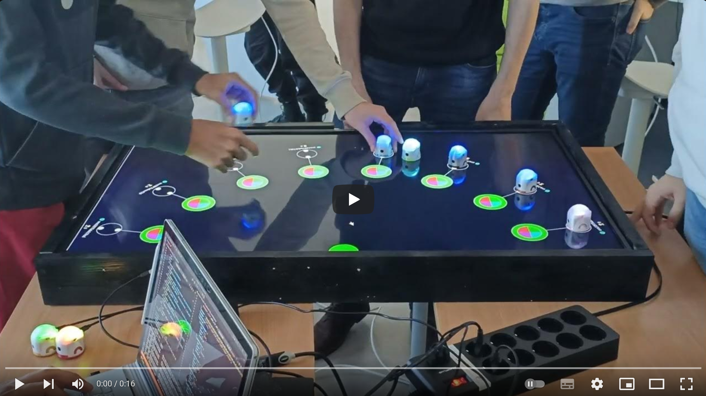
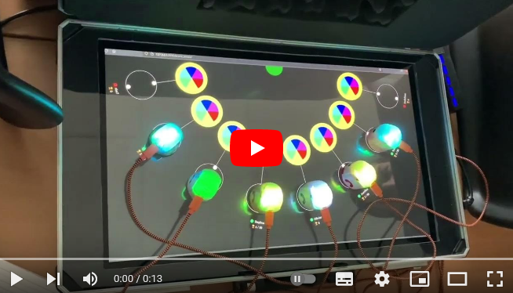

# Xihara
A playfull way to teach machine learning by giving the ability to 🤖[Ova bots](https://jusdeliens.com/ova) to recognize colors with their "camereye" 👁️

[](http://www.youtube.com/watch?v=3O7sKRbIdt4 "Click to watch students compete with others by developping the best machine learning algorithms")

## 🎲 Rules

In this multirobot challenge, each robot is placed above a screen, its camera pointing toward a colored circle.
The web application opened in fullscreen, listen to a server that controls the colors and make them change more or less randomly (it appears to be random, but you will discover later, it is not 🧐). 

In order to win, each robot must recognize the border color of the circle and change the RGB color of its LED accordingly.
The app keeps in the inner Xihara circle the possibles color to guess, so the robot can rely on it at any time.  

Here is an example of 4 images captured by one [Ova](https://jusdeliens.com/ova) at different time, where the server is set to display 3 colors to guess : 🔴red, 🟢green, 🔵blue.

  

The next level of Xihara challenge, called `SymphonX`, consists of associating colors to musical tones thanks to a dictionary sent by the server, where each color to guess (the key) comes with a frequency (the value) to play using the robot buzzer. Mastering LED RGB and buzzer tone frequency at the same time will give you more points for each color to guess. Finally, when a student manage to guess the melody played by the robots, the host stops the server and ends the game, and the winner will be the one with most points gained 🏆 


## 💻 Materials

Xihara challenges are performed by our students during our IA classrooms and special robotics events.

It requires the following materials :
- 1 [Ova](https://jusdeliens.com/ova) bot per student
- 1 computer per student
- 1 [15 inch tablet](https://support.microsoft.com/fr-fr/surface/surface-book-3-sp%C3%A9cifications-et-fonctionnalit%C3%A9s-261d4bb1-2851-d9d5-2020-283429f6cd8c) or any screen laid horizontally 
- A webrowser to display the Xihara arena and the colors to guess on the screen
- A MQTT broker as a hub. It can be the official online Jusdeliens's broker or your own local broker according to your wishes.
- 1 wifi access point available for every robots and computers 

Ideally, it can allow
- at most 8 students with 8 robots, but make sure to use a screen as big (a 55 inch screen was used during the last event show in the first picture below)
- at least 1 host, with good programming skills and a wide IA understanding

Whether your are a student or a teacher, feel free to [contact us](https://jusdeliens.com/contact) to setup your own gears to perform your Xihara challenge in your organization, we will be glad to show you how.

## 🧠 Skills

Solving this problem will allow you to master
- the notorious numpy, matplotlib, scikit learn and pillow python libraries
- a practical approach of image processing metrics and basics statistics such as gradient, mean, standard deviation 
- SVM, KNN with a good understanding of how they work, and how to assess and improve their performances
- best programming practices such as Object Oriented Programming, SOLID concepts, Test and Comment Driven Development
- conception skills using UML, class diagram and sequence diagram to properly add to your README in markdown

## 👣 Steps

In this order, you will have to 
### 1. 💡 Brainstorm how to make all this work

Think in term of responsabilities (SOLID, mostly S,O,I) or in domain (Domain Driven Design) to foresee the classes and objects of your design, and the todo list corresponding.

You may produce UML class diagram and sequence diagram to synthesize your design, using 
- [plantUML](https://plantuml.com/fr/) to be installed as extension in VSCode
- or [mermaid](https://mermaid.live/edit#pako:eNqdUsFOwzAM_RUrXIrofqDiNi47IKZNnOgOXuptFmlSUnfaGPt30nSDFhUO5NBU9vN79otPSruCVKa0wbp-YNx6LHML4cwWbu0E7j8mE3ja49QwWXl8E8ltB4glMJvzgcx0hx61kOd38qcuD3BnuJaXpXi22xUYXJOpk9thdmMcygp0jyBhK3BIob2OF_h5oDkrcUv_0Zz8qjmqM3XGkBbn4Ys_KHiqSb45Q0R3uKRAwXGi9uIN9xsVj2yTrlNoKwPrHGWXQuwPhGpZVoZlTl4H738Y15tkFbE9Zz1VzsuV2zWR96_6ylPBYYC-PYfRSbqt6NvRVKF56vtx4-xzDBZJfCng9jsExMSCNPF-FDZQHezfVfysUlWSL5GLsMAxmCvZUUm5ysJvgf41V7ltcdiIWx6tVpn4hlLV9XzZd5Vt0NR0_gQHNf3p) requiring only a web browser and an Internet connection

And export the diagrams (as `.svg` for plantUML, or base64 string for mermaid) and embeds in your README like this 👇

[](https://mermaid.live/edit#pako:eNqVVNuO2jAQ_RXLfUlV-AHUlwrUalV1i0CVKjU8DM4kjNaxqTOhbCn_XidmIQGnbPOQy8w5czkz8UEqm6GcSKWhqmYEhYMyNcJfD3Pao55uwIFidPQbnXj_ZzwWnxxkt747pI-k_fd_0xbFekZ5Psh7KKHAeDpsfT7AIHlqtUbF9sSZVrsZMJytcdSHmm3Ieo1rFKScXkpY7sqLaQDz2Zi7mEesnX0dDPQj8i_rnm7QC7u2HIBfdzDVhIa__GQO7p7pjGo-vlOjW6zfexwPt26ByhYmSB5o7Z7F5n0IfiHeaar4x5IdmWIlNKxRV8nbvjfXFnglVCdAQobFfiSax_MJfuzlvN2VV-YcD-aM5rkszDm-z-CwQr7E9BYVcEnmly4e6DzFS6HsgEwSKhUN00edA29Goq1PMFa83GriOTrlp3MlXKeTVYvtKOtwax2_xLZ1G_df_K3DjHwDXXn20U7C-nXlqLe-eOzq8caab60xS9pJCWrufUD4pVEh7aKwXtb-hh7iiKElv4-_WvAOQY5kia4EyvzB2ppTyRssMZUT_5qBe0plao4eB_40WT4bJSfsahzJIMvpHJaTHHSFx78yHecW)

Don't forget the 
- *Single responsability* : each class of your design must have only one reason to change. Name it with an action verb to make sure of it.
- *Interface segregation* : a user should not depend on things he does NOT need ! If I want to characterize any picture using your classes, it will be great to have the minimal dependencies all behind interfaces, thus, at worse, I will only have to redevelop 1 class that inherits from your interface.
- *Open to extension, close to modificaiton* : For instance make sure your characterizers can work with any data, coming from an [Ova](https://jusdeliens.com/ova) or anything else, to don't have to re-develop all your code each time you want to use with another camera. 


### 2. 🤖 Connect to your robot 

See in the pyrobotx `IRobot` interface and `OvaMqttClient` class how to use the API methods to connect your program to your robot through the mqtt broker and enable its camera to collect some pictures.

[](https://mermaid.live/edit#pako:eNptkMEKwjAMQH-lxMvE7QeGN73sIMLEWy-xDbO4ttp1A5n7d7fWoQNzCOXlhSTtQVhJkIOosWn2CiuHmhs2RlHai_Vs-8oyduxwVysy_vDwnpsohJZZ6yObYtPeJXpK1l-0suYcoEwKjRUxNeWlEAolCVLdX234nbpYaB4-QAqanEYlx4sC5OCvpIlDPj4luhsHbiYPW29PTyMg966lFOLOnw-IcHgDDQJbHQ)

### 3. 🚜 Automate the harvest

In order to auto collect and perform the labelling your data to be able to work with any color number (from 2 to 6).

During the "harvest", the Xihara server is set to change color at the same period (every second) in the same sequence according to the number of colors to guess.
The steps to consider are the following :
```
For each nColorToGuess, from 2 to 6
    For each color from 0 to nColorToGuess-1
        take many capture and label your picture in the train folder according to nColorToGuess and the actual color name in progress
```
You can also repeat the steps above in another loop to improve your training, by adding new "stresses" and noises each iteration (like changing robot position, change luminosity in the room) .

### 4. 📊 Characterize your data with metrics 

These metrics will be given to your classifier as input, and you know the GIGO saying : *"Garbage In, Garbage Out"* !
So make sure to use matplotlib and/or seaborn to generate report that demonstrates the validity of your metrics by producing `/train/report.png` figures using matplotib, before going any further implementing classification algorithms.


For instance, in the picture below 👆, we easily see that using mean and standard deviation characterizing allow us to segregate "by hand" the colored dots representing each labelled data. So any classifier should performed well considering this.

### 5. 🍜 Feed your classifiers for training

Assess their performances using sklearn confusion matrix and classification reports, and add it to your README like below.
```bash
Confusion matrix:
[[3 0 0 0]
 [0 4 0 0]
 [0 0 4 0]
 [0 0 0 4]]
              precision    recall  f1-score   support

           0       1.00      1.00      1.00         3
           1       1.00      1.00      1.00         4
           2       1.00      1.00      1.00         4
           3       1.00      1.00      1.00         4

    accuracy                           1.00        15
   macro avg       1.00      1.00      1.00        15
weighted avg       1.00      1.00      1.00        15
```

For instance, we see above 👆 a perfect confusion matrix and performances report with no error, but of course we only use 3+4+4+4 pictures for 4 classes to recognize. You should have a lot more pictures and metrics to feed your classifier and leading to more classification errors to be interpreted. 

### 6. 🚀 Deploy for production

In your main loop, use your trained model to
- Predict each new color and control the LED in loop
- Play the buzzer tone for each color in loop

And finally ... recognize the melody like a blind test !

[](https://www.youtube.com/watch?v=JdwyFdozNl0 "Click to play on youtube and guess the melody")


## ⚙️ Setup

1. Clone this repo
2. Update all submodules recursively
```
git submodule update --init --recursive
```
3. pip install all deps in [the requirement list](requirements.txt)
```
pip install --no-cache-dir -r requirements.txt
```
4. Add a .env file in the root project directory, containing the following credentials. If you don't have any credentials, feel free [to contact us](https://jusdeliens.com/contact) to join the adventure 🚀
```.env
# Credentials to connect to Ova bot
# The name of your player or your robot ID as str
ROBOTID         = ...
# The name of the arena to join as str
ARENA           = ...
# The broker user name provided by a Jusdeliens administrator as str
USERNAME        = ...
# The broker user password as str
PASSWORD        = ...
# The broker ip address or dns as str
BROKERADDRESS   = ...
# The broker port as int 
BROKERPORT      = ...
# Verbosity level as int from 0:no log, to 4: full debug logs
VERBOSITY       = 3 

# Train dir where images and csv file will be searched
TRAINDIRPATH="train"
TRAINDATASET="data.csv"

# Xihara train parameters to adjust according to server rules
TRAINNCOLORS=5
TRAINNCOLORCYCLES=2
TRAINDTCOLOR=5000
```
5. Then run the main.py with python interpretor (⚠️ at least version 3.9)
```
python main.py
```

Note: To update submodules if changed occurs outside this project, use this command
```
git submodule update --remote
```

## 📂 Folders

The following folders contain the solution of the challenge.
Ideally, students will have to rewrite it from scratch, guided by their host to make them use the best practices. 
And if they need help, they can keep the interfaces and implement the classes behind, and theirs methods.

### 📂 collector 
The python scripts used to capture and store pictures automatically for training classifiers. 

### 📂 characterizer
The python sources implementing different algorithms to assessing the picture to classify.

### 📂 classifier
The python scripts implementing different classifiers with common methods

### 📂 train
The `.jpeg` pictures collected during the train, and the `data.csv` containing the metrics assessed by characterizer for each picture of this folder.

## 🧑‍💻 Author
Designed with 💖 by [Jusdeliens Inc.](https://jusdeliens.com)

## ⚖️ License
Under CC BY-NC 4.0 licence 
👉 https://creativecommons.org/licenses/by-nc/4.0/deed.en

